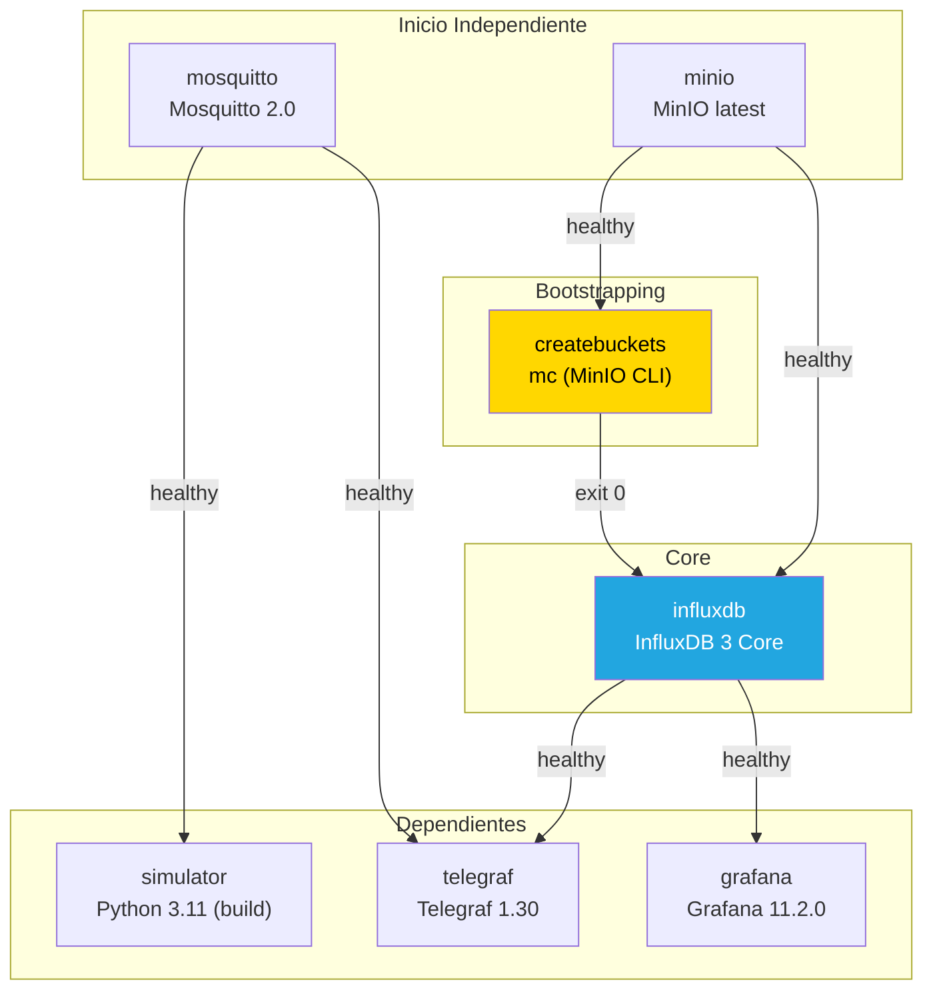

# Arquitectura — Planta de Gaseosas

Documentación completa de la arquitectura del stack de monitoreo. Si en 6 meses no te acordás de nada, este archivo te debería bastar para reconstruir el panorama mental.

---

## Diagrama de Flujo de Datos

```mermaid
flowchart LR
    S["🐍 Simulador Python\n11 sensores · 1 msg/s c/u\npaho-mqtt loop_start()"]
    M["📡 Mosquitto\nBroker MQTT 2.0\npuerto 1883"]
    T["⚙️ Telegraf\nmqtt_consumer → influxdb_v2\n11 msgs/s · flush 1s"]
    I["🗄️ InfluxDB 3 Core\nAPI v2 · puerto 8181\n--without-auth"]
    Mi["📦 MinIO\nS3-compatible\npuertos 9000/9001"]
    G["📊 Grafana\nInfluxQL datasource\npuerto 3000"]

    S -->|"MQTT publish\nplanta1/area/sensor/nombre\npayload: float ASCII"| M
    M -->|"MQTT subscribe\nplanta1/+/sensor/+"| T
    T -->|"POST /api/v2/write\nbucket=sensores\norg=\"\" · gzip"| I
    I -->|"S3 PUT\nParquet files"| Mi
    G -->|"InfluxQL query\nGET /query?db=sensores"| I

    style S fill:#2d8f2d,color:#fff
    style M fill:#cc7a1d,color:#fff
    style T fill:#5c5c5c,color:#fff
    style I fill:#22a6e0,color:#fff
    style Mi fill:#c7254e,color:#fff
    style G fill:#f46800,color:#fff
```

**El recorrido en una línea:** El simulador publica floats puros por MQTT → Mosquitto los distribuye → Telegraf los lee, agrega tags y los escribe en InfluxDB → InfluxDB los persiste como Parquet en MinIO → Grafana consulta via InfluxQL.

---

## Diagrama de Dependencias Docker Compose



**Orden de startup real** (lo que Docker Compose ejecuta):

1. `minio` y `mosquitto` arrancan simultáneamente (no dependen de nadie)
2. `createbuckets` espera a que `minio` esté healthy → crea bucket `influxdb3` → sale con código 0
3. `influxdb` espera a `minio` healthy Y `createbuckets` exit-0 → empieza a servir en puerto 8181
4. `simulator` espera a `mosquitto` healthy → empieza a publicar sensores
5. `telegraf` espera a `mosquitto` healthy Y `influxdb` healthy → empieza a ingerir
6. `grafana` espera a `influxdb` healthy → provisiona datasource, dashboards y alertas

Tiempo total estimado: ~30-60 segundos desde `docker-compose up -d` hasta todo healthy.

---

## Tabla de Servicios

| Servicio | Imagen | Puertos host | Volúmenes | Healthcheck | Propósito |
|----------|--------|-------------|-----------|-------------|-----------|
| **mosquitto** | `eclipse-mosquitto:2.0` | 1883:1883 | `./mosquitto/config/mosquitto.conf` (ro), `mosquitto_data:/mosquitto/data` | `mosquitto_sub` en `$SYS/broker/uptime` | Broker MQTT. Recibe publishes del simulador y distribuye a Telegraf. |
| **minio** | `minio/minio:latest` | 9000:9000 (API), 9001:9001 (Console) | `minio_data:/data` | `curl /minio/health/live` | Object storage S3-compatible. Backend de persistencia de InfluxDB 3 (almacena Parquet files). |
| **createbuckets** | `quay.io/minio/mc:latest` | — | ninguno | — (one-shot, `restart: on-failure`) | Job que crea el bucket `influxdb3` en MinIO antes de que InfluxDB arranque. Elimina race condition. Reintenta si MinIO no está listo. |
| **influxdb** | `influxdb:3-core` | 8181:8181 | `influxdb_data:/var/lib/influxdb3` | `curl /health` en puerto 8181 | Time-series database. Recibe datos de Telegraf via API v2, los serializa a Parquet y los escribe en MinIO. |
| **telegraf** | `telegraf:1.30` | — (interno) | `./telegraf/telegraf.conf` (ro) | `pgrep telegraf` | Agente de ingestión. Suscribe a MQTT, parsea topics (UNS), extrae tag `area`, escribe en InfluxDB. |
| **grafana** | `grafana/grafana:11.2.0` | 3000:3000 | `./grafana/provisioning` (ro), `./grafana/dashboards` (ro), `grafana_data:/var/lib/grafana` | `curl /api/health` | Visualización y alertas. Datasource InfluxQL sobre InfluxDB, dashboard pre-provisionado, 2 alertas. |
| **simulator** | build local (`python:3.11-slim`) | — (interno) | ninguno | `pgrep -f sensores.py` | Simulador Python. 11 sensores, 1 msg/s c/u, topics UNS, spikes cada 5 min. |

---

## Por Qué Este Stack

### Time-series DB: InfluxDB 3 Core vs. Alternativas

| Opción | Por qué sí | Por qué no |
|--------|-----------|-----------|
| **InfluxDB 3 Core** ✅ | Object store nativo (Parquet en S3/MinIO), sin gestión de discos. API v2 compatible con Telegraf. InfluxQL para consultas simples. Open-source, sin licencias para uso local. | No tiene Processing Engine en la versión Core (no hay tareas de retención automática). Sin auth en modo dev (pero es aceptable para desarrollo local). |
| TimescaleDB | Potente con SQL completo, joins con datos relacionales. | Requiere PostgreSQL como base. Más pesado. Overkill para este caso donde solo hay time-series. |
| Prometheus | Estándar para métricas de infraestructura. Pull-based, no push. | No está diseñado para high-write ingestion de sensores. No tiene object store nativo. Retención por disco local. |
| ClickHouse | Excelente performance analítica. | Curva de aprendizaje más empinada. No tiene plugin nativo de Telegraf. Más complejo de configurar con object storage. |

**Veredicto**: InfluxDB 3 Core es la opción más simple que cumple todo lo necesario: ingesta via API v2 (compatible con Telegraf), persistencia en Parquet/MinIO, y consultas InfluxQL desde Grafana sin plugins extra.

### Broker MQTT: Mosquitto

| Opción | Por qué sí | Por qué no |
|--------|-----------|-----------|
| **Mosquitto** ✅ | Ligero (~5MB), estándar de facto para MQTT. Eclipse Foundation. Simple de configurar. Versión 2.0 requiere configuración explícita de listeners (buena práctica). | No tiene clustering nativo (no importa para desarrollo local). |
| EMQX | Cluster-ready, dashboard web, plugins. | ~200MB de imagen. Overkill para 11 sensores a 1 msg/s. |
| RabbitMQ (con plugin MQTT) | Si ya tenés RabbitMQ en infra, es gratis agregar MQTT. | Setup más complejo. RabbitMQ no es un broker MQTT puro — el plugin tiene limitaciones. |

### Agente de Ingestión: Telegraf

| Opción | Por qué sí | Por qué no |
|--------|-----------|-----------|
| **Telegraf** ✅ | Plugin nativo `mqtt_consumer` + `influxdb_v2`. Procesadores de tags built-in (regex para UNS). Flush configurable. Parte del stack InfluxData, integración perfecta. | Otro contenedor que mantener. Pero es prácticamente zero-config. |
| Script custom Python | Flexibilidad total. | Reimplementar reconexión MQTT, batching, retry logic, healthcheck. Telegraf ya lo hace y está probado en producción. |
| Fluent Bit | Buen performance, plugins MQTT. | Output para InfluxDB v3 no está tan maduro. Menos documentación para este caso de uso específico. |

### Visualización: Grafana

| Opción | Por qué sí | Por qué no |
|--------|-----------|-----------|
| **Grafana** ✅ | Estándar de la industria. Provisioning as code (YAML + JSON). Alertas nativas. Plugin InfluxQL funciona out-of-the-box con InfluxDB 3 Core. Dashboard folders, permisos, etc. | Curva de aprendizaje para alertas (pero la documentación es excelente). |
| Chronograf | UI simple de InfluxData. | Menos maduro. Sin provisioning as code robusto. Alerting limitado. |
| Custom frontend (React/Next.js) | Control total del UI. | [TODO] No es parte de este stack actualmente. Sería un cambio futuro si se necesita un dashboard custom además de Grafana. |

### Object Storage: MinIO

| Opción | Por qué sí | Por qué no |
|--------|-----------|-----------|
| **MinIO** ✅ | S3-compatible, open-source. API drop-in replacement de AWS S3. Ligero. Consola web incluida. InfluxDB 3 lo soporta nativamente. | No es un S3 real (emula la API). Para producción real se usaría AWS S3 o similar. |
| Disco local en InfluxDB | Más simple, un componente menos. | InfluxDB 3 Core **requiere** object store (S3-compatible). No soporta filesystem local como la versión 1.x. |

---

## Decisiones de Arquitectura

| Decisión | Choice | Razón |
|----------|--------|-------|
| **Sin auth en InfluxDB** | `--without-auth` | InfluxDB 3 Core no bootstrapea tokens via env vars. Chicken-and-egg para `docker-compose up` limpio. El README advierte que esto es SOLO para desarrollo. |
| **Sin TLS interno** | HTTP/ MQTT plano | Stack local en bridge network. Para producción se necesita TLS en mosquitto, HTTPS en InfluxDB, y certificados. |
| **MQTT anonymous** | `allow_anonymous true` | Mosquitto 2.0+ lo exige explícitamente o falla con "not authorised". En localhost es aceptable. |
| **Telegraf `organization = ""`** | String vacío | InfluxDB 3 Core ignora la org pero la API v2 la valida. Cualquier valor no vacío → HTTP 400. |
| **createbuckets como servicio separado** | `restart: on-failure` + `service_completed_successfully` | Garantiza que el bucket existe antes de que InfluxDB intente escribir. Reintenta automáticamente si MinIO aún no está listo. |
| **Healthchecks en todos los servicios** | `condition: service_healthy` en `depends_on` | Sin healthchecks, Docker Compose no garantiza orden real. Los services pueden estar "running" pero no "ready". |
| **Provisioning Grafana as code** | YAML + JSON files | Reproducible, versionable, sin click-ops. Grafana 11+ requiere YAML para alertas (la UI ya no las persiste en SQLite). |
| **UNS (Unified Naming System)** | `planta1/<area>/sensor/<nombre>` | Organiza 11 sensores en 6 áreas. Evita colisiones de measurement names cuando múltiples áreas comparten tipos de sensor (ej. `temperatura`). |

---

## Nota sobre lo que NO hay

Este stack **no incluye** (y es intencional):

- **API REST** — No hay FastAPI ni servicio de API. Grafana consulta InfluxDB directamente via InfluxQL. [TODO] Si se necesita un API para un frontend custom, sería un nuevo componente.
- **Frontend web custom** — No hay Next.js ni React. Grafana es la UI. [TODO] Si se necesita una vista custom fuera de Grafana, se agregaría.
- **Retención de datos automática** — InfluxDB 3 Core no tiene retention policies en la versión Core. Los Parquet se acumulan en MinIO hasta que se borren manualmente o se configure lifecycle.
- **Autenticación en producción** — Este stack es exclusivamente para desarrollo local. Ver README.md para los pasos de hardening.
